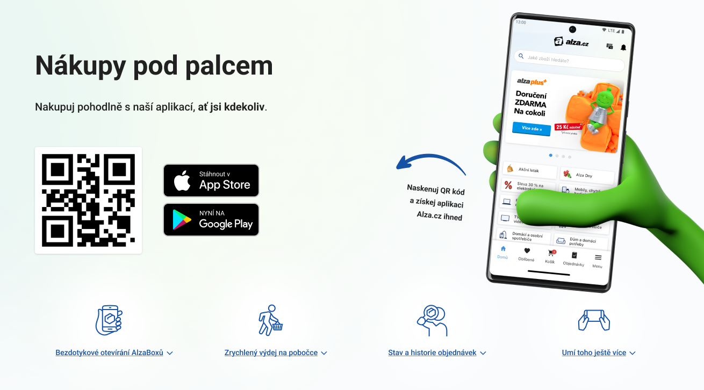

# LANDING PAGE

Případová studie pro výběrové řízení Web Designer & Developer (HTML, CSS, JS).

- [Zadání](#Zadání)
- [Rozsah a realizace](#Rozsah-a-realizace)
- [Shrnutí](#Shrnutí)

## Zadání
Dokončit grafický návrh ve Figmě (bez responzivních návrhů), který se bude skládat z hlavičky a 4 bloků.

Dle dokončeného grafického návrhu vytvořit Landing Page, která bude mít max. šířku 1310px a bude responzivní až do šířky 325px.

Požadavkem je, aby z hlavičky vedly kotvy na jednotlivé sekce s použitím vlastního scriptu (tj. bez použití scriptů třetích stran).

Výstupem bude dokončený grafický návrh ve Figmě a responsivní stránka, která bude obsahovat soubor index.html a složky - img, css a js.

Screenshot grafického návrhu hlavičky najdete na *[desktop-design.png](./design/header-design.png)*

## Rozsah a realizace

Stručný výčet znalostí, které jsem v úkolu využila.

- rozvržení layoutu webu CSS **flexboxem**
- **responzivní layout** - mobile-first a media query
- jednotky pro tvorbu webu (**em**, **rem**, **%**, **px**)
- pojmenování CSS tříd metodikou **BEM**
- organizace a rozdělení CSS za pomocí **Sass** - proměnné a zanořování
- **transformace** CSS vlastností
- SVG ikony v externím **SVG sprite**
- JS události - **mouse events**, **scroll**
- JS časovače - **setTimeout**
- uložení souborů v repozitáři na **GitHub** a jeho publikování na **GitHub Pages**

## Shrnutí

Čím mi byla tato studie přínosem.

- **pozicování pseudoprvků pozadí ::after, ::before** barevného přechodu pro pozadí hlavičky
- **pořadí qr kódu a buttonů ke stažení** přes vlastnost `order` (vycházející z `display: flex`) pro mobile-first zařízení
- **centrování textu/odkazu na kotvy vůči ikonám** do kterého se nezapočítává šířka pseudoprvku textu ::after
- **obarvení SVG ikon** přes vlastnost `fill`
- vytvoření **interaktivní stránky pomocí JS**